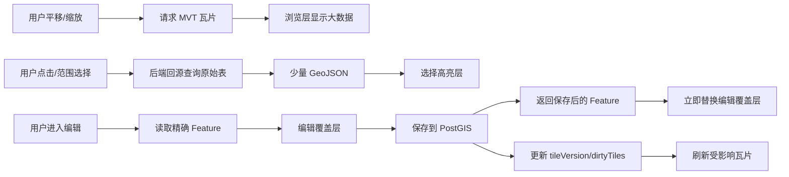

# 大数据矢量编辑性能优化实施方案

## 1. 背景与目标

WebQGIS 的核心目标不是只把 90w+ 矢量数据“显示出来”，而是让用户像在 QGIS 中一样完成浏览、选择、编辑、保存、刷新、属性联动等完整 GIS 工作流。

如果把大表要素全部转成前端可编辑 Feature，会出现几个问题：

- 首屏加载慢，内存占用高。
- OpenLayers VectorSource 中 Feature 数量过大，选择、样式计算、命中检测都会变慢。
- 编辑一个要素后，为了刷新显示而重拉整层数据，响应不可接受。
- 如果只依赖 MVT 或离线瓦片，编辑后的当前对象又无法立即保持精确显示。

因此本方案采用“浏览层快、编辑层准、保存后即时覆盖、瓦片异步一致”的架构：

> 浏览大量数据使用 MVT/缓存瓦片；选择和编辑只回源加载少量精确 GeoJSON；保存成功后立即更新编辑覆盖层，同时用 tileVersion 或 dirtyTiles 增量刷新浏览瓦片。

这份文档不是概念说明，而是给 Codex agent 分阶段实现的落地说明。每个阶段都包含目标、边界、涉及文件、实现步骤、验收标准和可直接交给 agent 的任务描述。

## 2. 当前代码基础

### 2.1 前端核心文件

- `apps/web/src/components/workbench/WebGisWorkbench.vue`
  - 工作台编排层。
  - 负责菜单、工具栏、图层面板、编辑面板、地图事件与 workspace/editor 的连接。
- `apps/web/src/composables/useOpenLayersEditor.ts`
  - OpenLayers 地图和图层控制层。
  - 负责 MVT 图层、选择高亮层、编辑覆盖层、绘制、节点编辑、范围选择。
- `apps/web/src/composables/useWebGisWorkspace.ts`
  - 前端业务状态层。
  - 负责图层列表、活动图层、选择要素、编辑草稿、保存/删除接口调用。
- `apps/web/src/types/gis.ts`
  - 前端 GIS 类型定义。
- `apps/web/src/components/workbench/EditInspector.vue`
  - 编辑属性面板。
- `apps/web/src/components/workbench/LayerPanel.vue`
  - 图层面板。
- `apps/web/src/components/workbench/AttributeTablePanel.vue`
  - 属性表面板。

### 2.2 服务端核心文件

- `apps/api/src/layers/layers.controller.ts`
  - 图层 HTTP 接口。
  - 包括图层列表、瓦片、要素读取、范围选择、新增、更新、删除等入口。
- `apps/api/src/layers/layers.service.ts`
  - 图层业务服务。
  - 负责编排图层元数据和 PostGIS 仓储。
- `apps/api/src/postgis/postgis.repository.ts`
  - PostGIS SQL 访问层。
  - 负责 MVT 生成、GeoJSON 读取、空间查询、要素写入。
- `apps/api/src/types.ts`
  - 服务端共享类型。

### 2.3 当前关键路径

- MVT 浏览层：
  - `getVectorTile()` 使用 `ST_AsMVTGeom` / `ST_AsMVT` 实时生成瓦片。
- 点击选择：
  - 前端从 MVT 命中要素 ID。
  - 后端 `readFeature()` 回源读取精确 GeoJSON。
  - 前端写入选择状态和编辑源。
- 范围选择：
  - 前端绘制范围。
  - 调用 `/features/select` 返回 ids/features。
  - 前端写入 `selectedFeatureSource` 显示高亮。
- 保存编辑：
  - 前端调用 `POST/PUT /features`。
  - 服务端写入 PostGIS 后返回保存后的 Feature。
  - 前端刷新图层或重新加载编辑 Feature。

## 3. 总体架构

### 3.1 四层模型

大数据编辑必须把显示、选择、编辑、刷新拆开，不能用一套 Feature 集合承担所有职责。

| 层级 | 前端承载 | 数据来源 | 职责 | 一致性要求 |
| --- | --- | --- | --- | --- |
| 浏览层 | `VectorTileLayer` / `VectorTileSource` | MVT/缓存瓦片/离线瓦片 | 快速显示大量要素 | 可延迟一致 |
| 选择高亮层 | `selectedFeatureSource` / `selectedFeatureLayer` | 少量 GeoJSON | 点击、范围、自定义范围选择结果 | 立即一致 |
| 编辑覆盖层 | `editSource` / `editLayer` | 单个或少量精确 GeoJSON | 绘制、节点编辑、保存后的最新几何 | 必须立即一致 |
| 刷新协调层 | tileVersion / dirtyTiles / tile cache | 服务端元数据 | 编辑后刷新受影响瓦片 | 最终一致 |

### 3.2 关键原则

- 浏览层永远不作为编辑数据源。
- 编辑、点击读取、范围查询永远回源查原始 PostGIS 表。
- MVT 可以缓存，可以落后，但编辑覆盖层必须显示最新保存结果。
- 选择高亮和编辑草稿必须有清晰边界，不能互相“残留”。
- 保存后先更新前端覆盖层，再处理 MVT 刷新。
- 对大表必须依赖空间索引，所有空间查询都要先 bbox 过滤，再做精确判断。

### 3.3 推荐数据流



## 4. 性能策略选型

### 4.1 不推荐：全量 GeoJSON 加载

不适合 WebQGIS 的大表编辑场景。

- 90w+ Feature 会导致前端内存和渲染压力过大。
- 样式函数、命中检测、属性联动会持续变慢。
- 保存后 diff 和重渲染成本过高。

### 4.2 不推荐：只用离线瓦片

适合浏览，不适合编辑。

- 瓦片是显示产物，不是编辑源。
- 保存后的当前对象无法立刻从瓦片中得到精确反馈。
- 对频繁编辑的图层，离线瓦片重建成本高。

### 4.3 推荐：MVT + 精确编辑覆盖层

这是 WebQGIS 的主路线。

- 大范围浏览：MVT/缓存瓦片。
- 点击/范围选择：后端原始表查询，返回少量 Feature。
- 编辑：只把当前编辑对象放入 `editSource`。
- 保存：服务端返回最新 Feature，前端立即替换覆盖层。
- 后续：用 tileVersion 和 dirtyTiles 让 MVT 逐步一致。

### 4.4 推荐：分阶段从实时 MVT 进化到缓存/离线

先保证编辑体验正确，再逐步优化瓦片生成成本。

1. 状态边界正确。
2. 保存后立即反馈。
3. tileVersion 缓存失效。
4. dirtyTiles 精准刷新。
5. 多尺度概化表。
6. 离线瓦片发布。
7. 并发编辑冲突处理。

## 5. 阶段 0：状态边界梳理

### 5.1 目标

先把“浏览、选择、编辑”三类状态边界理清楚，避免后续优化时旧高亮、旧草稿、旧选中 ID 互相污染。

这一阶段不追求瓦片缓存，也不改变后端 SQL，只处理前端状态模型和交互一致性。

### 5.2 要解决的问题

- 点击选择后，再做范围选择，旧点击高亮可能残留。
- 范围选择后，再点击选择，旧范围高亮可能残留。
- 编辑草稿存在时，切换选择方式或图层可能静默清空草稿。
- `selectedFeatureId`、`selectedProperties`、`selectedFeatureSource`、`editSource` 的生命周期边界不够清晰。

### 5.3 实现边界

本阶段要做：

- 明确 `VectorTileSource`、`selectedFeatureSource`、`editSource` 的职责。
- 新增统一的选择视觉清理方法。
- 新增编辑草稿 dirty 标记。
- 在切换选择方式、切换图层、关闭编辑、移除图层前保护未保存草稿。
- 补充单元测试。

本阶段不做：

- 不改 MVT SQL。
- 不做 tileVersion。
- 不做缓存。
- 不做 dirtyTiles。
- 不改变数据库结构。

### 5.4 建议改动文件

- `apps/web/src/composables/useOpenLayersEditor.ts`
- `apps/web/src/composables/useWebGisWorkspace.ts`
- `apps/web/src/components/workbench/WebGisWorkbench.vue`
- `apps/web/src/components/workbench/WebGisWorkbench.test.ts`
- 可选：`apps/web/src/composables/useOpenLayersEditor.test.ts`

### 5.5 具体实现步骤

1. 在 `useWebGisWorkspace.ts` 中新增编辑草稿状态：
   - `isDraftDirty`
   - `hasUnsavedEditDraft`
   - `markDraftDirty()`
   - `markDraftClean()`
   - `clearSelectedFeatureState()`
2. 在 `setSelectedFeature()` 时将 dirty 置为 false。
3. 在 `clearDraftState()` 时同时清理 dirty。
4. 在 `saveFeature()` 成功后将 dirty 置为 false。
5. 在 `useOpenLayersEditor.ts` 中提供明确清理方法：
   - `clearSelectionFeatures()`
   - `clearEditableFeature()`
   - `hasEditableFeature()`
6. 在绘制完成、节点修改完成后调用 `markDraftDirty()`。
7. 在 `WebGisWorkbench.vue` 中新增统一清理方法：
   - `clearSelectionVisuals()`
   - `canDiscardCurrentDraft(actionLabel)`
8. 切换到范围选择或自定义范围选择前：
   - 如果存在未保存草稿，阻止并提示。
   - 如果没有未保存草稿，清理旧点击选择和编辑视觉。
9. 切换到点击选择时：
   - 清理范围选择高亮。
   - 保留或恢复点击选择流程。
10. 切换图层、关闭编辑、移除图层、独显图层前：
   - 如果存在未保存草稿，阻止并提示。
   - 如果没有未保存草稿，允许清理。

### 5.6 验收标准

- 点击选择一个要素后，只出现点击选择高亮。
- 再执行范围选择，点击高亮消失，只保留范围结果高亮。
- 范围选择后再点击选择，范围高亮消失，只保留点击结果高亮。
- 节点编辑或绘制后，切换图层/切换范围选择不会静默丢失草稿。
- 保存成功或主动清除草稿后，允许切换图层和选择方式。

### 5.7 测试建议

- `WebGisWorkbench.test.ts`
  - 测试点击选择切到范围选择时调用 `clearSelectionFeatures()`。
  - 测试范围选择切回点击选择时清理旧范围高亮。
  - 测试存在 dirty 草稿时阻止切换选择方式。
  - 测试存在 dirty 草稿时阻止移除图层。
- `useOpenLayersEditor.test.ts`
  - 测试 drawend/modifyend 会触发 `markDraftDirty()`。
  - 测试 `clearSelectionFeatures()` 不清理编辑源。
  - 测试 `clearEditableFeature()` 不清理范围高亮。

### 5.8 给 Codex Agent 的任务

```text
你是 Agent A：高亮与编辑状态模型。

请实现 WebQGIS 大数据矢量编辑性能优化方案的阶段 0。

目标：
1. 明确浏览层、选择高亮层、编辑覆盖层的状态边界。
2. 点击选择、范围选择、自定义范围选择之间切换时，旧高亮不能残留。
3. 存在未保存编辑草稿时，不能静默切换图层、移除图层、关闭编辑或切换到范围选择。
4. 补充 Vitest。

重点文件：
- apps/web/src/composables/useOpenLayersEditor.ts
- apps/web/src/composables/useWebGisWorkspace.ts
- apps/web/src/components/workbench/WebGisWorkbench.vue
- apps/web/src/components/workbench/WebGisWorkbench.test.ts

实现后运行：
- npm run typecheck
- npm --workspace apps/web run test

完成后写进度文档并提交。
```

## 6. 阶段 1：编辑后即时反馈

### 6.1 目标

用户保存编辑后，不等待 MVT 瓦片刷新，就能立即看到服务端确认后的最新几何和属性。

### 6.2 要解决的问题

- MVT 是瓦片显示产物，保存后可能仍显示旧几何。
- 如果只刷新 MVT，用户会看到延迟、闪烁或旧新几何重叠。
- 保存后前端应优先信任服务端返回的 Feature，而不是本地草稿。

### 6.3 实现边界

本阶段要做：

- 保存接口继续返回保存后的完整 GeoJSON Feature。
- 前端保存成功后，用返回 Feature 替换 `editSource` 中的编辑对象。
- `workspace` 中同步更新 `selectedFeatureId`、`selectedProperties`、`draftGeometry`。
- 新增“被编辑覆盖”的 ID 集合，用于弱化或隐藏 MVT 中的旧要素。

本阶段不做：

- 不做瓦片缓存。
- 不精确计算 dirtyTiles。
- 不改多尺度概化表。

### 6.4 建议改动文件

- `apps/web/src/composables/useWebGisWorkspace.ts`
- `apps/web/src/composables/useOpenLayersEditor.ts`
- `apps/web/src/components/workbench/WebGisWorkbench.vue`
- `apps/web/src/types/gis.ts`
- 可选：`apps/web/src/composables/useOpenLayersEditor.test.ts`

### 6.5 具体实现步骤

1. 确认服务端 `createFeature()` 和 `updateFeature()` 返回保存后的完整 Feature。
2. 在 `useWebGisWorkspace.ts` 中保存成功后：
   - `setSelectedFeature(savedFeature)`
   - `draftGeometry = savedFeature.geometry`
   - `markDraftClean()`
3. 在 `useOpenLayersEditor.ts` 中增加覆盖 ID 状态：
   - `coveredFeatureIdsByLayer: Map<string, Set<string | number>>`
   - `markFeatureCovered(layerId, featureId)`
   - `clearCoveredFeature(layerId, featureId)`
   - `clearCoveredFeatures(layerId)`
4. 保存成功后：
   - `editor.loadEditableFeature(savedFeature)`
   - `editor.markFeatureCovered(activeLayerId, savedFeature.id)`
   - `editor.refreshLayer(activeLayerId)` 可以保留为后续一致性动作，但视觉上不依赖它。
5. 调整 MVT 样式函数：
   - 如果当前 MVT feature id 在 `coveredFeatureIdsByLayer` 中，则返回透明样式或空样式。
   - 避免旧瓦片几何盖住编辑覆盖层。
6. 当图层 MVT 完成新版本刷新后，可清理该图层 covered ID。

### 6.6 样式策略建议

优先选择“隐藏旧 MVT 要素”：

- 编辑覆盖层已经显示最新 Feature。
- 旧 MVT 要素继续显示会造成重影和误判。
- 如果隐藏不稳定，可退化为低透明度显示。

### 6.7 验收标准

- 编辑一个已有要素并保存后，地图上立即显示新几何。
- 新增要素保存后，立即显示新增 Feature。
- 保存后即使 MVT 还没刷新，旧几何也不会明显覆盖新几何。
- 保存成功后属性面板显示服务端返回属性。

### 6.8 测试建议

- 保存成功后调用 `loadEditableFeature(savedFeature)`。
- 保存成功后对应 feature id 进入 covered 集合。
- MVT 样式函数遇到 covered id 时返回隐藏/弱化样式。
- 保存失败时不更新 covered 集合。

### 6.9 给 Codex Agent 的任务

```text
你是 Agent B：保存后即时覆盖显示。

请实现 WebQGIS 大数据矢量编辑性能优化方案的阶段 1。

目标：
1. 保存成功后使用服务端返回 Feature 立即替换编辑覆盖层。
2. 同步 workspace 的 selectedFeatureId、selectedProperties、draftGeometry。
3. 新增 coveredFeatureIdsByLayer，避免旧 MVT 几何与最新编辑覆盖层重叠。
4. 保存失败时不能误更新覆盖状态。

重点文件：
- apps/web/src/composables/useWebGisWorkspace.ts
- apps/web/src/composables/useOpenLayersEditor.ts
- apps/web/src/components/workbench/WebGisWorkbench.vue
- apps/web/src/types/gis.ts

实现后运行：
- npm run typecheck
- npm --workspace apps/web run test

完成后写进度文档并提交。
```

## 7. 阶段 2：tileVersion 与瓦片缓存

### 7.1 目标

让 MVT 可以缓存，同时保证编辑保存后前端能请求新版瓦片，避免每次平移缩放都实时打 PostGIS。

### 7.2 要解决的问题

- 当前实时 MVT 每次请求都可能触发 PostGIS 计算。
- 没有版本参数时，浏览器/CDN/服务端缓存很难安全复用。
- 编辑后需要一种低成本方式让旧瓦片失效。

### 7.3 实现边界

本阶段要做：

- 每个图层维护 `tileVersion`。
- 图层元数据返回 `tileVersion`。
- MVT URL 加 `?v=:tileVersion`。
- 编辑成功后递增 `tileVersion`。
- MVT 响应增加缓存头。
- 服务端增加最小可用缓存层。

本阶段不做：

- 不精确计算 dirtyTiles。
- 不做多尺度概化。
- 不做离线瓦片。

### 7.4 建议改动文件

- `apps/api/src/layers/layers.controller.ts`
- `apps/api/src/layers/layers.service.ts`
- `apps/api/src/postgis/postgis.repository.ts`
- `apps/api/src/types.ts`
- `apps/web/src/types/gis.ts`
- `apps/web/src/composables/useWebGisWorkspace.ts`
- `apps/web/src/composables/useOpenLayersEditor.ts`

### 7.5 数据结构建议

服务端类型：

```ts
export type LayerRegistration = {
  id: string;
  tileUrl: string;
  tileVersion: number;
  // existing fields...
};

export type FeatureWriteResult = {
  feature: GeoJSON.Feature;
  tileVersion: number;
};
```

最小实现可以先用内存：

```ts
const tileVersions = new Map<string, number>();
```

更稳妥实现：

- 写入图层 registry。
- 或新增图层元数据表。
- 或使用 Redis/hash 存储版本。

### 7.6 缓存 key

```text
layerId:z:x:y:tileVersion
```

例如：

```text
city:10:843:421:17
```

只要 `tileVersion` 不变，同一瓦片可以直接复用。

### 7.7 HTTP 缓存建议

MVT 响应头：

```http
Cache-Control: public, max-age=31536000, immutable
ETag: "layerId-z-x-y-v"
Content-Type: application/vnd.mapbox-vector-tile
```

因为 URL 中已经带版本号，版本 URL 可以长期缓存。

### 7.8 前端实现步骤

1. `LayerRegistration` 增加 `tileVersion`。
2. workspace 加载图层时保留 `tileVersion`。
3. 构造 MVT URL 时附加版本参数。
4. 保存接口如果返回 `{ feature, tileVersion }`：
   - 更新当前图层的 `tileVersion`。
   - 刷新 OpenLayers source。
5. 如果后端暂时只返回 Feature：
   - 保持兼容，使用当前刷新策略。

### 7.9 后端实现步骤

1. `layers.service.ts` 新增：
   - `getTileVersion(layerId)`
   - `bumpTileVersion(layerId)`
2. 图层列表接口返回 `tileVersion`。
3. 新增/更新/删除要素成功后递增版本。
4. MVT 接口读取请求中的 `v`，用于缓存 key。
5. 增加内存 LRU 缓存或 Redis 缓存。
6. 缓存未命中时调用 PostGIS 生成 MVT。
7. 缓存命中时直接返回 Buffer。

### 7.10 验收标准

- 连续请求同一个 `layerId/z/x/y/v`，第二次命中缓存。
- 编辑保存后，服务端返回新的 `tileVersion`。
- 前端图层 URL 变为新版 URL。
- 不编辑时反复平移回同一区域，不重复触发同一瓦片 SQL。

### 7.11 测试建议

- API 单测：
  - 同一版本同一瓦片命中缓存。
  - 保存 Feature 后版本递增。
  - 图层列表返回版本。
- Web 单测：
  - 图层版本变化后刷新 tile source。
  - 保存返回旧格式 Feature 时仍兼容。

### 7.12 给 Codex Agent 的任务

```text
你是 Agent C：tileVersion 与瓦片缓存。

请实现 WebQGIS 大数据矢量编辑性能优化方案的阶段 2。

目标：
1. 每个图层维护 tileVersion。
2. 图层列表和保存接口返回 tileVersion。
3. MVT URL 带版本参数。
4. 服务端按 layerId/z/x/y/tileVersion 缓存 MVT Buffer。
5. 编辑保存后递增版本并刷新前端图层。

重点文件：
- apps/api/src/layers/layers.controller.ts
- apps/api/src/layers/layers.service.ts
- apps/api/src/postgis/postgis.repository.ts
- apps/api/src/types.ts
- apps/web/src/types/gis.ts
- apps/web/src/composables/useWebGisWorkspace.ts
- apps/web/src/composables/useOpenLayersEditor.ts

实现后运行：
- npm run typecheck
- npm --workspace apps/api run test
- npm --workspace apps/web run test

完成后写进度文档并提交。
```

## 8. 阶段 3：dirtyTiles 精确刷新

### 8.1 目标

编辑后只刷新受影响瓦片，而不是让整个图层版本失效。

### 8.2 要解决的问题

- tileVersion 递增会让整个图层所有瓦片旧版本失效。
- 对大图层来说，只改一个面或一条线，不应该让所有区域的瓦片都重新生成。
- 需要逐步从“图层级失效”进化为“瓦片级失效”。

### 8.3 实现边界

本阶段要做：

- 保存前获取旧 geometry bbox。
- 保存后获取新 geometry bbox。
- 合并 old/new bbox。
- 按 zoom 范围计算受影响瓦片。
- 保存接口返回 `dirtyTiles`。
- 前端根据 dirtyTiles 决定刷新策略。

本阶段不做：

- 不强求 OpenLayers 单瓦片精确刷新一次到位。
- 如果前端单瓦片刷新受限，可以先退化为刷新当前图层 source。

### 8.4 建议改动文件

- `apps/api/src/postgis/postgis.repository.ts`
- `apps/api/src/layers/layers.service.ts`
- `apps/api/src/layers/layers.controller.ts`
- `apps/api/src/types.ts`
- `apps/web/src/types/gis.ts`
- `apps/web/src/composables/useWebGisWorkspace.ts`
- `apps/web/src/composables/useOpenLayersEditor.ts`

### 8.5 服务端返回结构

```ts
export type DirtyTile = {
  z: number;
  x: number;
  y: number;
};

export type FeatureWriteResult = {
  feature: GeoJSON.Feature;
  tileVersion: number;
  dirtyTiles: DirtyTile[];
};
```

### 8.6 算法步骤

1. 更新已有要素：
   - 更新前查询旧 bbox。
   - 执行更新。
   - 更新后查询新 bbox。
   - 合并 bbox。
2. 新增要素：
   - 只使用新 bbox。
3. 删除要素：
   - 删除前查询旧 bbox。
   - 删除后返回旧 bbox 对应 dirtyTiles。
4. bbox 转 tile：
   - 将 bbox 从图层 SRID 转为 EPSG:3857 或经纬度。
   - 按 `minZoom/maxZoom` 计算覆盖 tile。
   - 对面/线可按 bbox 扩展一个 buffer，避免边界漏刷。
5. 返回 dirtyTiles。

### 8.7 前端刷新策略

优先级：

1. 如果当前 OpenLayers source 支持单 tile 失效，则只刷新 dirty tile。
2. 如果不支持，刷新当前图层 source。
3. 当前视野不包含 dirty tile 时，可以只更新版本，不立即请求。

第一版可采用退化策略：

```text
收到 dirtyTiles -> 判断有 dirtyTiles -> refreshLayer(layerId)
```

后续再细化为单 tile。

### 8.8 验收标准

- 更新一个小要素后返回 dirtyTiles。
- 删除要素后返回旧位置 dirtyTiles。
- 新增要素后返回新位置 dirtyTiles。
- 前端保存后当前视野能看到刷新。
- 当前编辑覆盖层仍然立即显示最新 Feature，不依赖 dirtyTiles 完成。

### 8.9 测试建议

- API 单测：
  - bbox 跨多个 tile 时返回多个 tile。
  - 新增/更新/删除的 dirtyTiles 来源正确。
  - geometry 为空或异常时有合理退化。
- Web 单测：
  - 保存结果包含 dirtyTiles 时调用刷新。
  - dirtyTiles 为空时不报错。

### 8.10 给 Codex Agent 的任务

```text
你是 Agent D：dirtyTiles 精确刷新。

请实现 WebQGIS 大数据矢量编辑性能优化方案的阶段 3。

目标：
1. 新增、更新、删除要素后返回 dirtyTiles。
2. dirtyTiles 来自 old/new geometry bbox。
3. 前端收到 dirtyTiles 后刷新受影响图层，第一版可退化为刷新整个 source。
4. 编辑覆盖层即时反馈逻辑不能被破坏。

重点文件：
- apps/api/src/postgis/postgis.repository.ts
- apps/api/src/layers/layers.service.ts
- apps/api/src/layers/layers.controller.ts
- apps/api/src/types.ts
- apps/web/src/types/gis.ts
- apps/web/src/composables/useWebGisWorkspace.ts
- apps/web/src/composables/useOpenLayersEditor.ts

实现后运行：
- npm run typecheck
- npm --workspace apps/api run test
- npm --workspace apps/web run test

完成后写进度文档并提交。
```

## 9. 阶段 4：多尺度概化表

### 9.1 目标

让 90w+ 原始表不再承担所有 zoom 的 MVT 生成，低 zoom 用概化/聚合数据，高 zoom 才使用原始数据。

### 9.2 要解决的问题

- 小比例尺下原始 90w 要素没有必要全部参与瓦片生成。
- 面、线、点在不同 zoom 的合理显示策略不同。
- 实时从原始表生成低 zoom 瓦片会浪费数据库资源。

### 9.3 实现边界

本阶段要做：

- 设计多尺度数据源配置。
- MVT SQL 按 zoom 选择不同表。
- 提供概化表生成脚本。
- 保证选择、查询、编辑仍走原始表。

本阶段不做：

- 不让编辑写入概化表。
- 不让点击查询依赖概化表。
- 不强制一次性支持所有 geometry 类型的最佳算法，可以先按类型分批。

### 9.4 建议改动文件

- `apps/api/src/postgis/postgis.repository.ts`
- `apps/api/src/layers/layers.service.ts`
- `apps/api/src/layers/layers.repository.ts` 或现有图层注册模块
- `apps/api/src/types.ts`
- `scripts/build-simplified-layers.mjs`
- `scripts/generate-layer-scale-config.mjs`

### 9.5 配置结构建议

```ts
export type LayerScaleSource = {
  minZoom: number;
  maxZoom: number;
  schema: string;
  table: string;
  geometryColumn: string;
  idColumn?: string;
};

export type LayerRegistration = {
  // existing fields...
  scaleSources?: LayerScaleSource[];
};
```

示例：

```json
{
  "scaleSources": [
    {
      "minZoom": 0,
      "maxZoom": 6,
      "schema": "public",
      "table": "china_province_simplified_z0_6",
      "geometryColumn": "geom"
    },
    {
      "minZoom": 7,
      "maxZoom": 10,
      "schema": "public",
      "table": "china_province_simplified_z7_10",
      "geometryColumn": "geom"
    },
    {
      "minZoom": 11,
      "maxZoom": 22,
      "schema": "public",
      "table": "china_2025_province",
      "geometryColumn": "geom"
    }
  ]
}
```

### 9.6 概化策略

面：

- `ST_SimplifyPreserveTopology`
- 按面积阈值过滤极小面。
- 保留主键或原始 ID 映射字段。

线：

- `ST_Simplify`
- 按长度和道路等级过滤。
- 高 zoom 保留更多细节。

点：

- 低 zoom 聚合为网格、H3、quadbin 或聚类点。
- 高 zoom 显示原始点。

### 9.7 MVT 查询路由

`getVectorTile(layerId, z, x, y)`：

1. 读取图层 scaleSources。
2. 找到包含 z 的数据源。
3. 如果没有匹配，回退原始表。
4. 使用选中的 schema/table/geometryColumn 生成 MVT。

### 9.8 验收标准

- z <= 6 不再从原始 90w 表生成瓦片。
- 高 zoom 仍能看到原始精度。
- 点击查询、范围选择、编辑保存仍基于原始表。
- 概化表缺失时能回退原始表并给出可诊断日志。

### 9.9 测试建议

- 不同 zoom 选择不同 scaleSource。
- scaleSource 缺失时回退原始表。
- 编辑接口不使用 scaleSource。
- 生成脚本 dry-run 输出 SQL。

### 9.10 给 Codex Agent 的任务

```text
你是 Agent E：多尺度数据源。

请实现 WebQGIS 大数据矢量编辑性能优化方案的阶段 4。

目标：
1. 为图层增加 scaleSources 配置。
2. MVT 查询按 zoom 路由到概化表或原始表。
3. 查询、选择、编辑继续走原始表。
4. 提供概化表生成脚本，至少支持面图层。

重点文件：
- apps/api/src/postgis/postgis.repository.ts
- apps/api/src/layers/layers.service.ts
- apps/api/src/types.ts
- scripts/

实现后运行：
- npm run typecheck
- npm --workspace apps/api run test

完成后写进度文档并提交。
```

## 10. 阶段 5：离线瓦片发布

### 10.1 目标

对稳定或半稳定的大数据图层，建立类似 GIS 发布服务的瓦片生产链路，避免所有浏览请求都实时访问 PostGIS。

### 10.2 可选路线

PMTiles：

- 适合静态文件分发。
- 可放对象存储/CDN。
- 前端可通过 PMTiles 协议读取。

MBTiles：

- 适合服务端读取分发。
- 单文件 SQLite，便于管理。
- 可以与现有 API 兼容。

预生成 MVT 目录：

- 实现简单。
- 文件数多时需要对象存储或合理分片。

### 10.3 编辑后的更新策略

- 小改动：
  - 继续用编辑覆盖层立即显示。
  - 后台异步重算 dirtyTiles。
- 批量编辑：
  - 标记图层瓦片版本。
  - 后台队列重建受影响 zoom 范围。
- 大规模数据更新：
  - 重新发布瓦片包。

### 10.4 建议新增模块

- `apps/api/src/tile-cache/`
- `apps/api/src/tile-jobs/`
- `scripts/generate-tiles.mjs`
- `scripts/build-pmtiles.mjs`

### 10.5 实现步骤

1. 定义 tile package 元数据：
   - layerId
   - version
   - minZoom/maxZoom
   - bounds
   - format
   - storagePath
2. 新增瓦片发布脚本：
   - 输入 layerId/zoom 范围。
   - 遍历 tile 坐标。
   - 调用现有 MVT 生成函数。
   - 写入 PMTiles/MBTiles/目录。
3. API 支持读取已发布瓦片。
4. 前端图层元数据增加 tileSourceType：
   - live
   - cached
   - pmtiles
   - mbtiles
5. 编辑保存后继续走覆盖层即时显示。
6. 后台任务重建受影响瓦片后更新 package version。

### 10.6 验收标准

- 静态大图层浏览不依赖实时 PostGIS MVT。
- 编辑保存后当前对象仍立即显示最新结果。
- 后台重建完成后刷新页面能看到瓦片中的新结果。
- 离线包缺失或读取失败时能回退 live MVT。

### 10.7 给 Codex Agent 的任务

```text
你是 Agent F：离线瓦片发布。

请实现 WebQGIS 大数据矢量编辑性能优化方案的阶段 5。

目标：
1. 设计 tile package 元数据。
2. 新增瓦片生成脚本。
3. API 能读取已发布瓦片。
4. 前端能根据图层元数据选择 live/cached/offline 瓦片源。
5. 编辑保存仍通过编辑覆盖层即时显示。

重点文件：
- apps/api/src/tile-cache/
- apps/api/src/tile-jobs/
- apps/api/src/layers/
- apps/web/src/composables/useOpenLayersEditor.ts
- scripts/

实现后运行：
- npm run typecheck
- npm --workspace apps/api run test
- npm --workspace apps/web run test

完成后写进度文档并提交。
```

## 11. 阶段 6：并发编辑与冲突处理

### 11.1 目标

避免多人编辑同一要素时出现静默覆盖。

### 11.2 要解决的问题

- 用户 A 和用户 B 同时读取同一要素。
- A 保存后，B 再保存可能覆盖 A 的修改。
- 没有版本校验时，用户无法知道自己基于旧数据编辑。

### 11.3 实现边界

本阶段要做：

- 读取要素时返回版本。
- 保存时带版本。
- 后端更新时校验版本。
- 冲突时返回 409。
- 前端给出冲突处理入口。

本阶段不做：

- 不做实时协同编辑。
- 不做多人光标。
- 不做自动合并复杂几何。

### 11.4 版本字段选择

优先级：

1. 自定义 revision 字段。
2. `updated_at` 字段。
3. PostgreSQL `xmin`。

`xmin` 可作为最小落地方案，但要注意：

- 它是 PostgreSQL 系统列。
- dump/restore、vacuum freeze、跨库迁移场景需要谨慎。
- 长期产品化建议使用显式 revision 字段。

### 11.5 服务端流程

1. `readFeature()` 返回：
   - Feature
   - revision
2. 前端保存时提交：
   - Feature geometry/properties
   - revision
3. 后端更新：
   - `WHERE id = $id AND revision = $revision`
4. 如果影响行数为 0：
   - 返回 409。
5. 成功后：
   - 返回最新 Feature 和新 revision。

### 11.6 前端流程

冲突时提示用户：

- 重新加载服务端版本。
- 放弃本地修改。
- 强制覆盖保存。

第一版建议只实现：

- 提示冲突。
- 提供“重新加载服务端版本”。
- 不做强制覆盖，避免误操作。

### 11.7 验收标准

- 两个客户端同时编辑同一要素，后保存者收到 409。
- 冲突后可以重新加载服务端版本。
- 不会静默覆盖别人已经保存的修改。

### 11.8 给 Codex Agent 的任务

```text
你是 Agent G：并发编辑与冲突处理。

请实现 WebQGIS 大数据矢量编辑性能优化方案的阶段 6。

目标：
1. 读取要素时返回 revision。
2. 保存时提交 revision。
3. 后端基于 revision 校验更新。
4. 冲突返回 409。
5. 前端显示冲突状态，并支持重新加载服务端版本。

重点文件：
- apps/api/src/postgis/postgis.repository.ts
- apps/api/src/layers/layers.controller.ts
- apps/api/src/layers/layers.service.ts
- apps/api/src/types.ts
- apps/web/src/types/gis.ts
- apps/web/src/composables/useWebGisWorkspace.ts
- apps/web/src/components/workbench/EditInspector.vue

实现后运行：
- npm run typecheck
- npm --workspace apps/api run test
- npm --workspace apps/web run test

完成后写进度文档并提交。
```

## 12. 推荐实施顺序

必须按以下顺序做，不能先做后面的缓存或离线瓦片再回头补状态边界。

1. 阶段 0：状态边界梳理。
2. 阶段 1：编辑后即时反馈。
3. 阶段 2：tileVersion 与瓦片缓存。
4. 阶段 3：dirtyTiles 精确刷新。
5. 阶段 4：多尺度概化表。
6. 阶段 5：离线瓦片发布。
7. 阶段 6：并发编辑与冲突处理。

原因：

- 阶段 0 决定前端状态是否可靠。
- 阶段 1 决定编辑体验是否能脱离瓦片延迟。
- 阶段 2/3 才是瓦片刷新和缓存问题。
- 阶段 4/5 是更大规模数据发布能力。
- 阶段 6 是多人编辑安全能力。

## 13. 任务拆分总表

| Agent | 阶段 | 目标 | 主要范围 | 是否可并行 |
| --- | --- | --- | --- | --- |
| Agent A | 阶段 0 | 状态边界与高亮清理 | Web 前端 | 必须先做 |
| Agent B | 阶段 1 | 保存后即时覆盖显示 | Web 前端 | 依赖 A |
| Agent C | 阶段 2 | tileVersion 与缓存 | API + Web | 依赖 B |
| Agent D | 阶段 3 | dirtyTiles 精确刷新 | API + Web | 依赖 C |
| Agent E | 阶段 4 | 多尺度概化表 | API + scripts | 可在 C 后并行预研 |
| Agent F | 阶段 5 | 离线瓦片发布 | API + scripts + Web | 依赖 C/E |
| Agent G | 阶段 6 | 并发冲突处理 | API + Web | 可在 B 后并行预研 |

## 14. 每个 Agent 的通用执行要求

每个 Codex agent 接到任务后都必须：

1. 先阅读本方案对应阶段。
2. 先用 `git status --short --branch` 确认工作区。
3. 不回滚用户已有改动。
4. 只修改自己阶段涉及文件。
5. 实现前先搜索现有模式，不另起一套风格。
6. 实现后运行对应测试。
7. 在 `进度文档/` 下新增进度记录。
8. 进度记录必须包含：
   - 本次目标
   - 修改文件
   - 完成内容
   - 未完成内容
   - 测试结果
   - 后续建议
9. 提交到 `main` 分支。

## 15. 风险与注意事项

- 不要把 MVT Feature 当成编辑源。
- 不要为了刷新一个编辑对象重拉整张表。
- 不要在存在未保存草稿时静默切换图层或选择方式。
- 不要让范围选择结果和点击选择结果同时占用同一套状态。
- 不要让概化表参与编辑写入。
- 不要让缓存影响编辑覆盖层的即时显示。
- 不要先做离线瓦片发布再补保存后即时反馈。
- 不要把 3857/4326 坐标混用，前端显示坐标和后端数据 SRID 必须明确转换边界。

## 16. 最小可交付路线

如果只想先把 90w+ 图层做到“能快、能编辑、保存后不迷惑”，最小路线是：

1. 完成阶段 0。
2. 完成阶段 1。
3. 完成阶段 2 的 tileVersion，不一定马上做 Redis。
4. 阶段 3 先退化为刷新整个图层 source。
5. 对最大表补阶段 4 的概化表。

这样可以先达到：

- 浏览不卡。
- 编辑只加载少量精确 Feature。
- 保存后立即看到最新结果。
- MVT 旧数据不会明显误导用户。
- 后续再逐步降低 PostGIS 实时瓦片压力。
